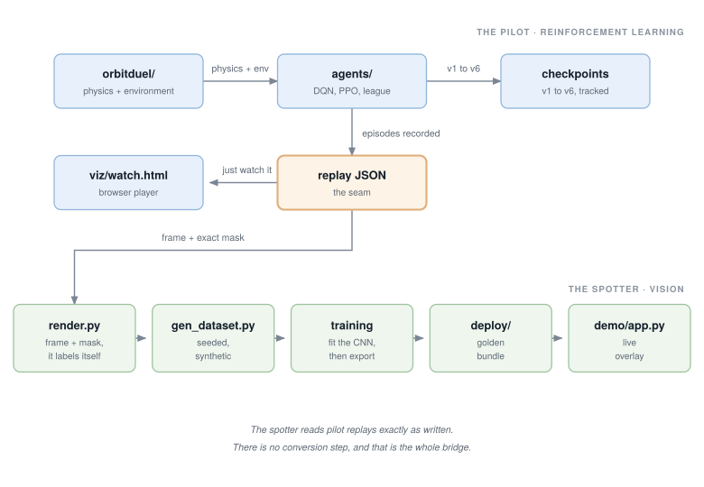

# ml-toys

Small, complete machine-learning systems you can actually run, retrain, and take
apart. Two of them: an orbital-duel
[reinforcement-learning](docs/GLOSSARY.md#reinforcement-learning) environment,
with reference agents and every era of their training history, and a tiny
[computer-vision](docs/GLOSSARY.md#cnn) net that learns to watch those duels from
raw pixels. The physics began life in an arcade game of mine; that lineage is
recorded in [PROVENANCE.md](PROVENANCE.md), and the field itself is
self-contained, MIT, and yours to experiment in.

> **New to machine learning?** Start with [docs/START-HERE.md](docs/START-HERE.md).
> It explains what you are looking at, with no jargon and no math, in about five
> minutes. Already fluent? Skip to [What's in the box](#whats-in-the-box) or the
> [reward spec](docs/REWARD-SPEC.md).

The longer stories behind these systems are written up in
[the research notebooks](https://stonej-gh.github.io/research/). More of my
work, including the game these experiments came from, lives at
jeffrey-stone.com.

## Quickstart: the pilot

**1. Watch the champion take on the top scripted bot.** No install, no compute.
The curated replays ship in the repo, so all you need is a local web server.
The default gallery is the current champion against the ported top rung, a
genuinely close series; the picker also holds one historical gallery per rules
era, each showing that era's champion beating the opponent as it stood then:

```
python -m http.server 8000
# open http://localhost:8000/viz/watch.html
# defaults to the current champion vs the ported L10.
# ?dir=replays/<era> opens a historical era's gallery (one directory per
#   era in replays/); ?run=<name> follows replays that a training script
#   is writing under runs/<name> right now.
```

That is the whole duel in your browser: a trained net flying against a hand-coded
opponent. Everything below re-creates and retrains what you just watched.

For the steps that run Python, install the package first (Python 3.10+):

```
python -m venv .venv
.venv/bin/pip install -e ".[train,viz,spotter,dev]"
source .venv/bin/activate      # so the plain `python` below is this venv
```

That install covers every command in this README. Training alone needs only
`".[train,viz,dev]"`; the `spotter` extra adds the web stack the
[demo](#quickstart-the-spotter) serves itself from.

**2. Run the current champion yourself.** Play goes through a pure-Python
[reference forward pass](docs/GLOSSARY.md#train-vs-inference) (no ML
framework needed), so the outcome is identical on any platform:

```
python agents/duel_eval.py
```

Expect a close match, around five wins in nine. The top rung is a port of the
game's own robot and it is genuinely hard; a champion that swept it would mean
the opponent was too easy. Add `--model agents/models/duel_ppo_v6_final.json`
to watch the previous era's champion meet the same bot, which it loses to about
nine times in ten. That gap is [experiment
03](experiments/03-generalization/README.md).

**3. Watch an agent that learned to cheat.** This is the wall-riding champion
from an early era, put back in the broken world it exploited, with the counters
that caught it:

```
python agents/duel_eval.py --model agents/models/duel_ppo_v1.json \
    --rules v1-freewalls --level 10
# then compare: viz/watch.html?dir=replays/v3-wallrider
```

The reward specification, and the four exploits that shaped it, are in
[docs/REWARD-SPEC.md](docs/REWARD-SPEC.md). Read that first if you read one thing
here.

**4. Train a survivor from scratch.** A 5,126-parameter
[Double DQN](docs/GLOSSARY.md#double-dqn) learns to rescue a doomed orbit in a
few minutes of CPU:

```
python agents/dqn_survive.py
```

## What's in the box

| path | what |
|---|---|
| `orbitduel/` | Layer 0: stdlib physics core, `OrbitDuel-v0` [Gymnasium](docs/GLOSSARY.md#environment) env, era rule presets, scripted opponent ladder L1-L10, survive task, dependency-free policy forward |
| `agents/` | single-file reference trainers ([DQN](docs/GLOSSARY.md#dqn), [PPO](docs/GLOSSARY.md#ppo), [league self-play](docs/GLOSSARY.md#league)) plus `duel_eval.py`, era checkpoints v1-v6 and the ported-ladder champions in `agents/models/` |
| `viz/` | Layer 1: replay-schema readers, browser viewer (`watch.html`), video renderer |
| `replays/` | curated galleries: the current champion vs the ported L10, plus one historical gallery per era (wall rider, honest era, v6); see `tools/curate_era_replays.py` |
| `experiments/` | graded questions: survive, reward hacking, generalization, fuel and laser ablations, spotter port ([index](experiments/README.md)) |
| `exercises/` | the back of the book: every DIY exercise walked through, with runnable sample solutions and measured results ([index](exercises/README.md)) |
| `spotter/` | the eye: seeded renderer-labeler, tiny [segmentation](docs/GLOSSARY.md#segmentation) net, training, export, [int8 quantization](docs/GLOSSARY.md#quantization) |
| `deploy/` | the spotter's frozen golden bundle: numpy reference forward, seeded vectors, `verify.py` |
| `demo/` | local web demo running off the frozen bundle |
| `assets/` | recorded duel traces the renderer-labeler consumes |
| `docs/` | [start-here](docs/START-HERE.md), [glossary](docs/GLOSSARY.md), [reward spec](docs/REWARD-SPEC.md), [learning notes](docs/LEARNING-NOTES.md), [spotter design](docs/SPOTTER-DESIGN.md) |
| `tests/` | analytic physics checks, bit-exact determinism, golden evals, train smoke, spotter gates |

Layering is a tested invariant: `orbitduel/` imports no viz, no trainers, and no
LLM anything, and the suite proves the core still trains with those directories
deleted.

The two halves meet in one place: the replay JSON. Everything downstream of
training, the viewer, the video renderer, and the spotter's own training
data, reads that same archive.



## Quickstart: the spotter

The perception half is a 28,126-parameter
[segmentation](docs/GLOSSARY.md#segmentation) net whose training data comes from
its own renderer, so every label is free and pixel-perfect. Its story:
[The net that watches the screen](https://stonej-gh.github.io/research/spotter/).

**1. Verify the frozen bundle.** Numpy only, no training, no torch. The
[golden](docs/GLOSSARY.md#golden-bundle) vectors prove the reference forward
bit for bit:

```
python deploy/verify.py
```

**2. See it watch a duel.** A live overlay with a float/int8 A/B toggle, running
off the frozen bundle. Needs the `spotter` extra from the
[install above](#quickstart-the-pilot) (it serves the overlay over HTTP):

```
python demo/app.py    # http://127.0.0.1:5051
```

**3. Retrain it from scratch.** All data is generated in-repo from seeds, about
five minutes end to end on a laptop:

```
python tools/gen_dataset.py
python -m spotter.train_heatmap && python -m spotter.export
python -m spotter.train_dense   && python -m spotter.export --mode dense
python tools/build_bundle.py && python deploy/verify.py
```

Design notes and the five recorded lessons:
[docs/SPOTTER-DESIGN.md](docs/SPOTTER-DESIGN.md). The replay traces the renderer
consumes come from this repo's RL half, so the two systems are the two halves of
one autonomy stack: a policy that decides, and perception that sees.

## Experiments

Six packaged questions in [experiments/](experiments/README.md), each a README
plus a `run.py`, most with a seeded, thresholded grader. The friendliest place to
start is [02-reward-hacking](experiments/02-reward-hacking/README.md): train a
fresh agent in the arena's original broken ruleset and watch it discover, within
a minute of CPU, that riding the free walls beats learning to fly.

```
python -m pytest -m grade_cheap -q     # run every grader
```

## Tests

```
.venv/bin/python -m pytest tests/ -q
```

Golden evaluations are exact-match rather than tolerance-based: the shipped v6
champion must reproduce the recorded outcomes on the recorded seeds, through the
reference forward pass, on every platform.

## License and support

MIT ([LICENSE](LICENSE)); independent work, see [PROVENANCE.md](PROVENANCE.md).
Solo-maintained in spare time: [SUPPORT.md](SUPPORT.md).
