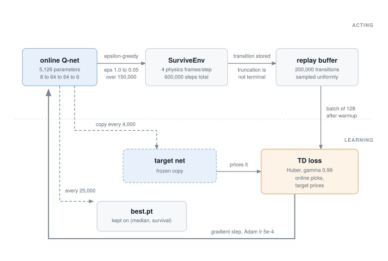

# Learning notes: how to rebuild this experiment yourself

A living document (started 2026-07-01, updated as the project moves) whose job
is to let you re-create everything in this repo by hand, from scratch,
understanding every step. It's ordered the way the project actually unfolded,
because the failures were the lessons. Each stage names the concepts, the exact
code to read, what went wrong for us, and a do-it-yourself exercise.

Reading list woven through: Sutton & Barto, *Reinforcement Learning: An
Introduction* (free online) is the backbone; chapter pointers below.

---

## Stage 0: the environment IS the experiment

**Concept.** RL code is ~20% algorithm, ~80% environment + reward + evaluation
design. Every interesting result and every failure we hit lived in the
environment, not the neural net. (This stage is physics methodology; if the
integrator vocabulary is heavy going, skip to Stage 1. The machine learning
starts there and nothing later depends on this stage's numerics.)

**What we built.** A headless physics sim
([`orbitduel/physics.py`](../orbitduel/physics.py)): two ships, an
inverse-square field, thrust, lasers, and walls, running ~12,000
env-steps/second on CPU (RL needs millions of steps, so speed is the first
feature).

**The discipline that made it trustworthy:** never assume, measure. The
physics constants began life in
[Spacewar: Orbital Duel](https://jeffrey-stone.com/spacewar/), an arcade game
of mine (lineage in [PROVENANCE.md](../PROVENANCE.md)), but the property the
gymnasium actually depends on is internal consistency: one measured field
constant sets the orbits, the spawn speeds, and the muzzle speeds, so every
maneuver has a Newtonian answer and no number contradicts another.
- The field constant came from an empirical orbit fit (`v0^2 * r0`), and an
  independent coast measurement agreed on orbital period to 1.8%. Two routes,
  one constant.
- Thrust acceleration was *verified* by double-differentiating recorded
  positions, which exposed that the recorded forces and fields used different
  unit conventions. We would have shipped an inconsistent sim on arithmetic
  alone.
- Analytic self-tests ([`orbitduel/selftest.py`](../orbitduel/selftest.py))
  check Kepler's laws and energy conservation. Note the symplectic-integrator
  subtlety: semi-implicit Euler *wobbles* the orbit radius ~1% but never
  drifts. Test for secular drift, not analytic equality.

**DIY exercise.** Write a 100-line gravity sim (one body, inverse-square
field, semi-implicit Euler). Verify Kepler's third law numerically. Then
break it: switch to naive (explicit) Euler and watch energy blow up.

---

## Stage 1: value-based RL, DQN on the survive task

**Concepts.** The Markov Decision Process (the formal name for a world of
states, actions, and rewards where the present state carries everything the
future needs), [Q-function](GLOSSARY.md#q-value),
[temporal-difference bootstrapping](GLOSSARY.md#bootstrapping),
[experience replay](GLOSSARY.md#replay-buffer),
[target networks](GLOSSARY.md#target-network),
[epsilon-greedy exploration](GLOSSARY.md#epsilon-greedy). Sutton & Barto
ch. 3, 6, 16.1; the DQN paper (Mnih et al. 2015).

**What we built.** [`agents/dqn_survive.py`](../agents/dqn_survive.py), the
whole algorithm in one file on purpose. The policy is a 2×64 MLP (a plain
multi-layer perceptron: two hidden layers of 64), 5,126 parameters, the size
class of TD-Gammon, the 1992 backgammon net that made tiny-net RL famous,
and small enough for a microcontroller. The
trained checkpoints are `survive_dqn_v1` and `survive_dqn_v2` in
[`agents/models/`](../agents/models).

**Task design is half the work (our first lesson).** The first spawn
distribution was too easy: *doing nothing* survived 67% of episodes, so there
was nothing to learn. Hardened to doomed sub-circular spawns. Then the metric
lied: random's mean lifetime looked strong because the distribution was
bimodal. Use medians for lifetimes.

**Reward hacking (our second lesson).** Random thrusting survived 46% of
episodes by pumping orbital energy and bouncing off the harmless walls. The
agent could have learned the same exploit; ours happened to circularize
instead. We *audited the behavior* (wall bounces, eccentricity), not just
the score. Later the duel agent DID exploit walls (Stage 3), and the fix was
physics plus reward, not hope.

**Instability (our third lesson).** Vanilla DQN at lr 1e-3 learned the skill
at update ~125k, then collapsed to ~5%: the "deadly triad" (bootstrapping +
function approximation + off-policy) plus max-operator overestimation. Fixes
that worked, in order of importance: **[Double DQN](GLOSSARY.md#double-dqn)** (online net picks the
action, target net prices it), lower lr (5e-4), slower target sync, and
(embarrassing but decisive) **always save the best checkpoint**. We lost our
first good policy by only saving at the end. Second subtlety: rank
checkpoints by *(median, survival-rate)* because the median saturates at the
episode cap.

The whole machine, one picture (every box is a name in
[GLOSSARY.md](GLOSSARY.md)):

**DIY exercise.** Reimplement DQN yourself against `SurviveEnv` (~150 lines).
Reproduce the collapse with vanilla DQN at lr 1e-3, then fix it with Double
DQN. Watching the collapse happen on demand teaches more than any paper.
This stage, packaged with a grader:
[experiment 01](../experiments/01-survive/README.md).

---

## Stage 2: policy-gradient RL, PPO on the duel

**Concepts.** [Policy gradients](GLOSSARY.md#policy-gradient),
[advantage estimation (GAE)](GLOSSARY.md#gae),
[the clipped surrogate objective](GLOSSARY.md#ppo),
[entropy bonus](GLOSSARY.md#entropy-bonus),
[actor-critic](GLOSSARY.md#actor-critic). Sutton & Barto ch. 13;
Schulman et al., *PPO* (2017) and *GAE* (2015). The style to imitate is
CleanRL: one file, no framework.

**What we built.** [`agents/ppo_duel.py`](../agents/ppo_duel.py): tiny
shared-trunk actor-critic, 8 parallel envs, curriculum over the scripted
pilot's levels (advance at 60% eval win rate). The env is `OrbitDuelEnv`
(registered as `OrbitDuel-v0`), and every rule era described below is
reproducible: `OrbitDuelEnv(rules="v1-freewalls")` is exactly the arena this
stage's agents trained in. (The flagship trainer itself runs the modern
defaults; the short-PPO path in
[experiment 02](../experiments/02-reward-hacking/README.md) is the one that
retrains in a chosen era.)

**Reward shaping without lying (fourth lesson).** The agent camped in the
"draw" attractor (safe orbit, 0 reward, forever). Those runs predate this
repo and their replay archives were not lifted, so the camping exists here
as history, not footage. (It also does not reproduce under the revised
physics: rerunning the recipe finds the wall exploit instead, which says
something real about how attractors move when worlds change.)
Pressure applied:
- a small **time cost** (draws stop being free);
- **potential-based distance shaping**: `γ·φ(s′) − φ(s)` with
  `φ = −c·dist/h`. The theorem (Ng, Harada, Russell 1999): shaping of exactly
  this form provably does NOT change which policy is optimal. Use it instead
  of ad-hoc bonuses wherever possible.
- per-hit rewards, which the duel itself scores (score-shaped, not invented).

**Constraints can help learning (fifth, most surprising lesson).** Two runs
plateaued at 100% draws. The run that cleared the whole L1→L10 ladder was the
one where we added the **fire cone** (trigger only works ≤15° off the bow),
added for *aesthetics*, not learning. Hypothesis: gating fire on aim collapses
the exploration problem, because approach, aim, and shoot become one
reinforced chain instead of three independent discoveries.
Constraint-as-scaffold is a real phenomenon; we found it by watching the
replays and reacting to what looked wrong. (One seed: outcome is fact,
mechanism is hypothesis.)

**A ladder trains a narrow pilot (sixth lesson).** The curriculum only ever
holds one opponent in front of the agent, so whatever it learns is fitted to
the rung it is standing on. Measured on a fixed panel under one ruleset, the
ladder checkpoint matches the league champion against the easiest opponent
and falls off steeply above it (45/48 vs 47/48 at L1, 4/48 vs 29/48 at L7).
The fix is a **league**: train against a pool holding all the scripted levels
plus past checkpoints, so the agent is asked to be good against a
distribution rather than against a rung. That is the Stage 4 design, and the
same reason OpenAI Five and AlphaStar used leagues.
[Experiment 03](../experiments/03-generalization/README.md) measures it.

**DIY exercise.** Derive the policy-gradient theorem for a 2-action bandit on
paper. Then implement REINFORCE (no critic, no clipping, ~60 lines) on
`SurviveEnv` and watch the variance problem PPO exists to solve.

---

## Stage 3: specification design, the wall-rebound episode

**Concept.** "The agent optimizes what you wrote, not what you meant":
[specification gaming](GLOSSARY.md#reward-hacking). Our duel agent adopted wall-rebound trajectories.
Legal, effective, ugly, and (the load-bearing detail) an artifact of the
arena's one non-physical element. Gravity, thrust, and lasers are Newtonian;
the boundary walls are not, and as free elastic bounces they offered
maneuvering the physics never priced. See it for yourself in
[`replays/v3-wallrider`](../replays/v3-wallrider), re-train in that arena
with `rules="v3-rude"`, or watch a fresh agent rediscover the exploit from
scratch in [experiment 02](../experiments/02-reward-hacking/README.md).

**The fix pattern, in order of preference:**
1. **Fix the physics first.** Walls now impart a decaying spin
   (`SPIN_DAMP = 3.0`) that fights steering, so the exploit is genuinely
   worse, not just taxed: the net must find a physical solution to orbital
   maneuvering rather than exploit the sim's non-physical boundary.
2. **Then encode the value judgment in reward.** A wall strike costs 0.8× a
   death (matching the hand-tuned bots' planning weight). The duel is about
   out-orbiting, and now the reward says so. This ruleset is
   `rules="v4-honest"`, and [`replays/v4-honest`](../replays/v4-honest) shows
   the resulting flying.
3. Keep the *evaluation* metrics (win rate) unshaped, so you can still see
   what the policy actually achieves.

**Measured outcome.** Wall touches: 12.2/episode -> 0.42 (29x). Draws
vanished; clean laser kills went 15 -> 336. And the curriculum deflated from
"L10 in 6 minutes" to "L4 in 9": the exploit had been carrying the blitz.
Expect this. **Removing an exploit usually makes your agent look worse and
your experiment more true.**

**DIY exercise.** Before reading our fix: how ELSE could an agent exploit
this arena spec? (Ideas we've already seen: hole-knock kills via hit
momentum; camping outside the opponent's range gate. What would you do about
each, physics-first?)

---

## Stage 4: the league, self-play and the generalist

**Concepts.** Fictitious self-play, [opponent pools](GLOSSARY.md#league),
non-transitivity and strategy cycling, prioritized opponent sampling. Read: AlphaStar league blog
(DeepMind 2019), OpenAI Five writeups; Sutton & Barto ch. 16 for TD-Gammon's
original self-play.

**What we built.** [`agents/league_duel.py`](../agents/league_duel.py):
every episode samples a fresh opponent, 60% a scripted level (weighted
toward the ones we're currently LOSING to, with a floor so no level ever
drops out of the mix) and 40% a frozen snapshot of the agent's own past self. The eval
yardstick is a fixed scripted panel, so "climbing" can't be curriculum
relabeling.

**Results.** The league generalist: **98-100% vs every level, 99.0% over
2,000 formal episodes**, with a phase transition around 8k updates from a
noisy 50-70% band to a sustained sweep. Two caveats on those numbers: one
training seed, and the era's own physics, since revised. The shipped
checkpoints' current matrix is
[experiment 03](../experiments/03-generalization/README.md), measured under
one common ruleset so the two trainers are compared on equal terms. The
comparison there is budget-confounded as well: the curriculum runs got
5,000 updates, the league 20,000, so the matrix compares shipped artifacts
rather than matched budgets (the matched-budget control is an open DIY).
Lesson, so hedged: **curricula climb, leagues generalize**. The mixed pool
converts "beat the current teacher" into "beat everyone I have ever met,
including myself." The champion is `duel_ppo_v6`
in [`agents/models/`](../agents/models) (full ruleset: `rules="v6-full"`),
and [`replays/v6-final`](../replays/v6-final) is its formal eval.

**Also here: constraint economics as behavior design.** The power-hover habit
was removed by translating the hand-tuned bots' fuel governor (an internal
budget: burn 0.67/s vs regen 0.035/s → ~5% duty) into reward economics
(0.05/wall-s of burn). The learned pilot landed at 7-8% thrust duty, inside
the scripted bots' discipline band, without any fuel mechanic in the physics.
Corollary lesson: prices must exceed prizes. At wall penalty 0.8 < win 1.0,
the agent rationally trades a wall scrape for a win (~3 scrapes/min). The
shipped `duel_ppo_v6` trained under the refinement price, wall 1.5 > win;
the `v6-full` preset keeps the era's original 0.8 as its default, so
reproducing the champion's economics takes
`league_duel.py --wall-pen 1.5`.

**DIY exercise.** Take your Stage 2-style trainer and add the simplest
league: keep the last 5 checkpoints, play 50% of episodes against a random
one. Compare the two policies across the whole panel, with and without the
pool, and watch what the spread between the easiest and hardest rung does.

---

## Stage 5: sim-to-real, what porting the pilot taught us

**Concepts.** [Sim-to-real transfer](GLOSSARY.md#sim-to-real), observation
parity, [inference without frameworks](GLOSSARY.md#train-vs-inference).

**What we built.** The trained nets export to plain `.json` weight arrays
(the files in [`agents/models/`](../agents/models)), and a hand-written
~40-line forward pass (two hidden layers, tanh or relu per the export's
`activation` field, plus an argmax head) is all it takes to fly one. No
frameworks. In this repo that reference forward lives in
[`orbitduel/netpilot.py`](../orbitduel/netpilot.py), and
[`agents/duel_eval.py`](../agents/duel_eval.py) replays any exported `.json`
checkpoint through it, so you can check a hand-rolled port against torch
yourself. We used exactly this recipe to port the league champion back onto
the original engine, running on phone hardware;
[the worm write-up](https://stonej-gh.github.io/research/worm/) tells that
story in full.

**Transfer results.** The league champion, on the original engine vs its
scripted L10: **7-4** over 150 s (eleven games: a smoke signal, not a
statistic), despite the sim never modeling curved
lasers, hit-spin, or explosion bodies. Two measured gaps to remember: the
original L10 lands laser kills the sim's opponents never could (curve-aware
lead aim isn't in the scripted-pilot port), and thrust duty there ran 21% vs
the sim's 7% (different pressure, different dynamics). Sim-to-real always
costs something; measure it, don't assume it.

**The transfer-ranking lesson.** The complete-ruleset pilot (fuel-budgeted,
wall-clean, spawn-randomized) dominates in the sim with near-zero losses,
and LOST on the original engine to the scripted L10 that the ruder v3 beat.
Constraining behavior in sim does not preserve real-world ranking: subtler
policies lean harder on sim details (here, straight lasers vs the original
engine's curved ones). Close the model gap before tightening the style screws
further. [Experiment 05](../experiments/05-curved-lasers/README.md) isolates
the ballistics bit of that gap under today's physics. `gravity_on_lasers=True` became the next training flag, and
`rules="v6-full"` includes it.

**Correction (2026-07-06).** The laser gap was subtler than "the sim never
modeled curved lasers": the sim already applied gravity to the *opponent's*
shots. It was the *agent's own* shots that had been overlooked and flew
straight. So the agent trained on a lie about its own shots, not about the
world in general; `gravity_on_lasers=True` closed exactly that half of the
asymmetry. (The two paragraphs above predate this correction.)

**DIY exercise.** Write the forward pass by hand from the weights JSON in
any language (C makes the later fixed-point port easy) and verify output
equality against [`orbitduel/netpilot.py`](../orbitduel/netpilot.py) on 100
random observations. Then quantize weights to int8 and measure the win-rate
cost. That curve is the whole edge-AI methodology in one plot.

---

## Standing habits worth copying

- **One readable file per algorithm.** You can't debug what you can't see.
- **Archive everything; render later.** Every eval episode is a JSON replay;
  the live dashboard ([`viz/watch.html`](../viz/watch.html)) and the video
  renderer ([`viz/render_video.py`](../viz/render_video.py)) are both just
  readers of that archive, and the curated era replays in
  [`replays/`](../replays) (open any with `viz/watch.html?dir=replays/<era>`)
  are the archive's highlight reel. Metrics without replays hide reward
  hacking.
- **Fixed eval seeds; gates decided before the run.** Moving goalposts after
  seeing results is how you fool yourself.
- **Watch the replays.** Both behavioral discoveries (spray-fire, wall
  rebounds) were found by *looking*, not by any metric.
- **Tiny nets are a feature.** Full training runs are 3-6 minutes on CPU, so
  every hypothesis gets tested the moment it's stated. That loop speed, not
  any single trick, is why this project moves.

## Why the nets stay this small

The models are deliberately in the quantize-friendly size class: a
5,126-parameter policy fits in a couple of block RAMs on an FPGA, and a GPU
shader could run it. The path from here: plain weight arrays (done, the
`.json` files in [`agents/models/`](../agents/models)) → a hand-rolled
forward pass ([`orbitduel/netpilot.py`](../orbitduel/netpilot.py), or your
own in C) → post-training int8 quantization → quantization-aware training →
a fixed-point reference. Measure win-rate at every precision step;
accuracy-vs-precision curves are the whole edge-deployment methodology,
practiced on a model small enough to inspect by eye.

---

Where next: the [experiments](../experiments/README.md) package these stages
as runnable, graded questions; the [glossary](GLOSSARY.md) holds the
vocabulary; the [reward spec](REWARD-SPEC.md) is the duel's constitution.
