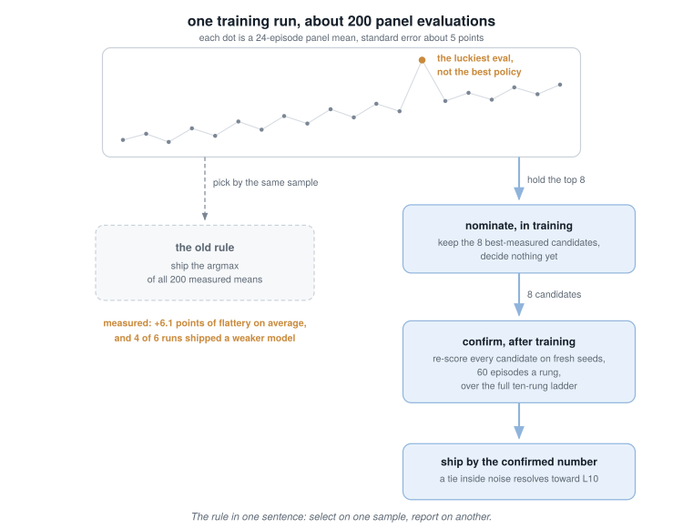

# Learning notes: how to rebuild this experiment yourself

A living document (started 2026-07-01, updated as the project moves) whose job
is to let you re-create everything in this repo by hand, from scratch,
understanding every step. It runs in the order the project actually happened,
because the failures were the lessons. Each stage names the ideas, points at
the exact code to read, tells you what went wrong for us, and ends with a
do-it-yourself exercise. Every exercise has a worked answer with a runnable
sample solution in [exercises/](../exercises/README.md), the back of the
book; do the exercise first.

One book runs underneath all of it: Sutton & Barto, *Reinforcement Learning:
An Introduction* (free online). Chapter pointers appear as they come up.

---

## Stage 0: the world is the experiment

**The idea.** Code for learning by trial and error is roughly 20% algorithm
and 80% world, reward, and measurement. Every interesting result in this
repo, and every failure, lived in the world we built, never in the neural
net. (This stage is about the physics; if the integrator talk gets heavy,
skip to Stage 1. The machine learning starts there, and nothing later
depends on this stage's math.)

**What we built.** A physics sim with no graphics
([`orbitduel/physics.py`](../orbitduel/physics.py)): two ships, gravity that
weakens with distance squared, thrust, lasers, and walls, running about
12,000 steps per second on an ordinary CPU. Learning by trial and error
needs millions of tries, so speed is the first feature a training world
needs.

**The habit that made it trustworthy: never assume, measure.** The physics
constants began life in
[Spacewar: Orbital Duel](https://jeffrey-stone.com/spacewar/), an arcade
game of mine (the lineage is in [PROVENANCE.md](../PROVENANCE.md)), but what
the gymnasium really depends on is that its numbers agree with each other:
one measured field constant sets the orbits, the spawn speeds, and the
muzzle speeds, so every maneuver has a Newtonian answer and no number
contradicts another.
- The field constant came from fitting a real orbit (`v0^2 * r0`), and a
  separate coasting measurement agreed on the orbital period to 1.8%. Two
  roads, one constant.
- The thrust strength was checked by taking recorded positions and
  differentiating them twice. That check caught a real mistake: the recorded
  forces and fields used different unit conventions, and we would have
  shipped a self-contradicting sim on arithmetic alone.
- Self-tests ([`orbitduel/selftest.py`](../orbitduel/selftest.py)) check
  Kepler's laws and that energy stays put. One subtlety worth knowing: the
  integrator we use (semi-implicit Euler) lets the orbit radius wobble about
  1% within each orbit but never lets it drift away over time. So test for
  slow one-way drift, not for perfect equality every step; a test that
  demands exactness will fail a perfectly good integrator.

**Do it yourself.** Write a 100-line gravity sim: one body, gravity toward a
point, semi-implicit Euler. Check Kepler's third law numerically. Then break
it on purpose: switch to plain (explicit) Euler and watch the energy grow
until the orbit is not an orbit.
*Back of the book:* [exercises/stage0-gravity](../exercises/stage0-gravity/README.md).

---

## Stage 1: learning by value, DQN on the survive task

**The ideas.** The Markov Decision Process (the formal name for a world of
states, actions, and rewards where the present moment carries everything the
future needs to know), the [Q-value](GLOSSARY.md#q-value),
[learning a guess from a guess](GLOSSARY.md#bootstrapping),
[experience replay](GLOSSARY.md#replay-buffer),
[target networks](GLOSSARY.md#target-network), and
[epsilon-greedy exploration](GLOSSARY.md#epsilon-greedy). Sutton & Barto
ch. 3, 6, 16.1; the DQN paper (Mnih et al. 2015).

**What we built.** [`agents/dqn_survive.py`](../agents/dqn_survive.py), the
whole algorithm in one file on purpose. The net is two hidden layers of 64
(a plain [MLP](GLOSSARY.md#neural-network)), 5,126 numbers in all: the same
size class as TD-Gammon, the 1992 backgammon net that made tiny-net
learning famous, and small enough for a microcontroller. The trained
checkpoints are `survive_dqn_v1` and `survive_dqn_v2` in
[`agents/models/`](../agents/models).

**Designing the task is half the work (our first lesson).** Our first spawn
setup was too easy: doing nothing at all survived 67% of episodes, so there
was nothing worth learning. We hardened it so every spawn is doomed without
a rescue burn. Then our scoreboard lied to us: random play LOOKED strong on
average lifetime, because its lifetimes pile up in two clumps, quick deaths
and lucky long survivals, and the average lands between them where no
episode actually lives. Report the median for lifetimes, not the mean.

**Reward hacking, first sighting (second lesson).** Random thrusting
survived 46% of episodes by pumping energy into the orbit and bouncing off
the then-harmless walls. Our agent could have learned that trick; it
happened to learn to fly instead. The important part is that we CHECKED,
by looking at the behavior (wall bounces, orbit shape) and not just the
score. Later the duel agent DID exploit the walls (Stage 3), and the fix
was physics plus reward, not hope.

**Instability (third lesson).** Plain DQN with a slightly hot learning rate
(1e-3) learned the rescue and then fell apart, down to 5% survival. The
field calls the risk zone the "deadly triad": a net that learns from its
own guesses, standing in for a lookup table, fed replayed old data. On top
of that, plain DQN's targets take a maximum over the net's own noisy
guesses, and a maximum over noise always reads high. The fixes that
mattered, in order: **[Double DQN](GLOSSARY.md#double-dqn)** (one net picks
the next action, the other prices it: two lines of code), a calmer learning
rate (5e-4), slower target syncing, and, embarrassing but decisive,
**always save the best checkpoint as you go**. We lost our first good
policy by only saving the final one. A second small trap: rank checkpoints
by median AND survival rate together, because the median maxes out at the
episode cap and stops separating good from better.

The whole machine, one picture (every box is a name in
[GLOSSARY.md](GLOSSARY.md)):

**Do it yourself.** Reimplement DQN against `SurviveEnv` (about 150 lines).
Reproduce the collapse with plain DQN at learning rate 1e-3, then fix it
with Double DQN. Watching the collapse happen on demand teaches more than
any paper. This stage, packaged with a grader, is
[experiment 01](../experiments/01-survive/README.md).
*Back of the book:* [exercises/stage1-dqn](../exercises/stage1-dqn/README.md).

---

## Stage 2: learning the behavior directly, PPO on the duel

**The ideas.** [Policy gradients](GLOSSARY.md#policy-gradient),
[advantage estimation (GAE)](GLOSSARY.md#gae),
[PPO's clipped update](GLOSSARY.md#ppo),
[the entropy bonus](GLOSSARY.md#entropy-bonus), and
[actor-critic](GLOSSARY.md#actor-critic) nets. Sutton & Barto ch. 13;
Schulman et al., *PPO* (2017) and *GAE* (2015). The style to imitate is
CleanRL: one file, no framework.

**What we built.** [`agents/ppo_duel.py`](../agents/ppo_duel.py): a small
two-headed net (the actor picks moves, the critic estimates how the duel is
going), 8 arenas running in parallel, and a curriculum that climbs the
scripted pilot's levels, advancing at a 60% eval win rate. The env is
`OrbitDuelEnv` (registered as `OrbitDuel-v0`), and every rule era described
below is reproducible: `OrbitDuelEnv(rules="v1-freewalls")` is exactly the
arena this stage's agents trained in. (The flagship trainer runs the modern
defaults; the short trainer in
[experiment 02](../experiments/02-reward-hacking/README.md) is the one that
retrains in a chosen era.)

**Shaping the reward without lying (fourth lesson).** The agent found the
"draw" attractor: park in a safe orbit, collect no penalty, forever. Those
runs predate this repo and their replays were not lifted, so the camping
exists here as history, not footage. (It also does not come back under the
revised physics: rerun the recipe and it finds the wall exploit instead,
which says something real about how loopholes move when worlds change.)
The pressure we applied:
- a small **time cost**, so draws stop being free;
- **a safe kind of hint**: give the agent a running meter (minus the
  distance to the opponent) and pay only for CHANGES in the meter. A bonus
  of exactly that shape provably cannot change what the best strategy is,
  only how quickly it is found (Ng, Harada, Russell 1999). Prefer it over
  ad-hoc bonuses wherever it fits.
- per-hit rewards, which the duel itself already scores, so they restate
  the game rather than invent strategy.

**Rules can help learning (fifth, most surprising lesson).** Two runs sat
at 100% draws and would not budge. The run that finally climbed the whole
L1 to L10 ladder was the one where we added the **fire cone** (the trigger
only works within 15° of the nose), and we added that for looks, not for
learning: spray-fire was ugly to watch. Our best guess at why it helped:
requiring aim before fire welds approach, aim, and shoot into one chain
that gets reinforced together, instead of three separate discoveries that
each need their own luck. A constraint acting as scaffolding is a real
phenomenon, and we found it by watching replays and reacting to what
looked wrong. (One seed, so: the outcome is fact, the mechanism is a
guess.)

**A ladder trains a narrow pilot (sixth lesson).** The curriculum only ever
holds one opponent in front of the agent, so whatever it learns fits the
rung it is standing on. Measured on a fixed panel under one ruleset, the
ladder checkpoint matches the league champion against the easiest opponent
and falls off steeply above it (45/48 against 47/48 at L1; 4/48 against
29/48 at L7). The fix is a **league**: train against a pool holding all the
scripted levels plus frozen copies of the agent's own past selves, so the
agent is asked to be good against a spread of opponents rather than one.
That is Stage 4, and it is the same reason OpenAI Five and AlphaStar used
leagues. [Experiment 03](../experiments/03-generalization/README.md)
measures the difference.

**Do it yourself.** Work out the policy gradient for a 2-action bandit on
paper. Then implement REINFORCE (no critic, no clipping, about 60 lines) on
`SurviveEnv` and watch the noise problem that PPO exists to solve.
*Back of the book:* [exercises/stage2-reinforce](../exercises/stage2-reinforce/README.md).

---

## Stage 3: writing the rules, the wall-rebound episode

**The idea.** The agent optimizes what you wrote, not what you meant:
[specification gaming](GLOSSARY.md#reward-hacking). Our duel agent took up
wall-rebound flying. Legal, effective, ugly, and (the load-bearing detail)
built on the arena's one non-physical element. Gravity, thrust, and lasers
obey Newton; the boundary walls do not, and as free elastic bounces they
offered free maneuvering the physics never priced. See it yourself in
[`replays/v3-wallrider`](../replays/v3-wallrider), retrain in that arena
with `rules="v3-rude"`, or watch a fresh agent rediscover the exploit from
scratch in [experiment 02](../experiments/02-reward-hacking/README.md).

**The fix pattern, in order of preference:**
1. **Fix the physics first.** Walls now put a decaying spin on your ship
   (`SPIN_DAMP = 3.0`) that fights your steering, so the exploit is
   genuinely worse, not just taxed: the net has to find a physical answer
   to orbital maneuvering rather than lean on a fake boundary.
2. **Then put the value judgment in the reward.** A wall strike costs 0.8x
   a death (matching the hand-tuned bots' own planning weight). The duel is
   about out-orbiting, and now the reward says so. This ruleset is
   `rules="v4-honest"`, and [`replays/v4-honest`](../replays/v4-honest)
   shows the resulting flying.
3. Leave the SCOREBOARD alone: win rate stays unshaped, so you can still
   see what the policy actually achieves.

**Measured outcome.** Wall touches per episode: 12.2 down to 0.42 (29x).
Draws vanished; clean laser kills went 15 to 336. And the curriculum slowed
from "L10 in 6 minutes" to "L4 in 9": the exploit had been carrying the
blitz. Expect this shape. **Removing an exploit usually makes your agent
look worse and your experiment more true.**

**Do it yourself.** Before reading our fixes: how ELSE could an agent
exploit this arena's spec? (Ideas we have already met: kills by knocking
the opponent into the hole with hit momentum; camping just outside the
opponent's firing range. What would you do about each, physics first?)
*Back of the book:* [exercises/stage3-exploits](../exercises/stage3-exploits/README.md).

---

## Stage 4: the league, playing your own past selves

**The ideas.** Self-play, [opponent pools](GLOSSARY.md#league), and the
fact that strategy quality is not a single ladder: rock beats scissors
beats paper, so "better" depends on who you ask. Read: DeepMind's AlphaStar
league blog (2019), the OpenAI Five writeups, and Sutton & Barto ch. 16 for
TD-Gammon, where self-play started.

**What we built.** [`agents/league_duel.py`](../agents/league_duel.py):
every episode draws a fresh opponent, 60% of the time a scripted level
(weighted toward the ones we are currently LOSING to, with a floor so no
level ever falls out of the mix) and 40% a frozen snapshot of the agent's
own past self. The eval yardstick is a fixed scripted panel, so "getting
better" is measured against something that never moves.

**Results.** The league generalist: **98-100% against every level, 99.0%
over 2,000 formal episodes**, with a sharp takeoff around 8,000 updates
from a noisy 50-70% band to a sustained sweep. Two caveats on those
numbers: one training seed, and that era's own physics, since revised. The
shipped checkpoints' current matrix is
[experiment 03](../experiments/03-generalization/README.md), measured under
one common ruleset so the two trainers meet on equal terms. That comparison
is also budget-lopsided: the curriculum runs got 5,000 updates, the league
20,000, so the matrix compares the artifacts this repo ships rather than
matched budgets (the matched-budget control is an open DIY). The lesson,
hedged accordingly: **curricula climb, leagues generalize.** The mixed pool
turns "beat the current teacher" into "beat everyone I have ever met,
including myself." The champion is `duel_ppo_v6` in
[`agents/models/`](../agents/models) (full ruleset: `rules="v6-full"`), and
[`replays/v6-final`](../replays/v6-final) is its formal eval.

**Also here: pricing behavior instead of scripting it.** The power-hover
habit (engine always on) went away when we translated the hand-tuned bots'
fuel governor (an internal budget: burn 0.67/s against regen 0.035/s, about
5% duty) into money: 0.05 per second of burn. The learned pilot settled at
7-8% duty, inside the scripted bots' discipline band, with no fuel mechanic
in the physics at all. And a corollary that bit us: **prices must beat
prizes.** At wall penalty 0.8 against a win worth 1.0, the agent rationally
trades scrapes for wins (about 3 a minute). The shipped `duel_ppo_v6`
trained at the refined price, wall 1.5, above the win; the `v6-full` preset
keeps the era's original 0.8 as its default, so reproducing the champion's
economics takes `league_duel.py --wall-pen 1.5`.

**Do it yourself.** Take your Stage 2-style trainer and add the simplest
possible league: keep the last 5 checkpoints, play half your episodes
against a random one. Grade both versions across the whole panel and watch
what happens to the spread between the easiest and hardest rung.
*Back of the book:* [exercises/stage4-league](../exercises/stage4-league/README.md).

---

## Stage 5: leaving the lab, what porting the pilot taught us

**The ideas.** [Sim-to-real transfer](GLOSSARY.md#sim-to-real), checking
that two implementations see the same world (observation parity), and
[inference without frameworks](GLOSSARY.md#train-vs-inference).

**What we built.** The trained nets export to plain `.json` weight files
(the files in [`agents/models/`](../agents/models)), and a hand-written
forward pass of about 40 lines (two hidden layers, tanh or relu as the
export says, then take the biggest output) is all it takes to fly one. No
frameworks. In this repo that reference lives in
[`orbitduel/netpilot.py`](../orbitduel/netpilot.py), and
[`agents/duel_eval.py`](../agents/duel_eval.py) replays any exported
checkpoint through it, so you can check a hand-rolled port against torch
yourself. We used exactly this recipe to carry the league champion back
onto the original engine, running on phone hardware;
[the worm write-up](https://stonej-gh.github.io/research/worm/) tells that
story in full.

**Transfer results.** The league champion, on the original engine against
its scripted L10: **7-4** over 150 seconds (eleven games: a smoke signal,
not a statistic), even though the sim never modeled curved lasers,
hit-spin, or explosion debris. Two measured gaps worth remembering: the
original L10 lands kills the sim's opponents never could (its lead-aim
understands the curve), and thrust duty over there ran 21% against the
sim's 7% (different pressure, different flying). Leaving the lab always
costs something; measure the cost, do not assume it.

**The ranking surprise.** The best-behaved pilot (fuel-budgeted,
wall-clean, spawn-randomized) dominated in the sim with almost no losses,
and then LOST on the original engine to the scripted L10 that the ruder v3
beat. Making the sim fairer does not preserve real-world ranking: subtler
policies lean harder on the sim's remaining lies (here, straight lasers
against an engine that curves them). Close the world gap before tightening
the style screws.
[Experiment 05](../experiments/05-curved-lasers/README.md) isolates the
ballistics piece of that gap under today's physics.
`gravity_on_lasers=True` became the next training flag, and `rules="v6-full"`
includes it.

**Correction (2026-07-06).** The laser gap was subtler than "the sim never
modeled curved lasers": the sim already curved the OPPONENT's shots. It was
the agent's OWN shots that had been overlooked and flew straight. So the
agent trained on a lie about itself, not about the world in general, and
`gravity_on_lasers=True` closed exactly that half of the asymmetry. (The
two paragraphs above predate this correction.)

**Do it yourself.** Write the forward pass by hand from the weights JSON,
in any language (C makes a later fixed-point port easy), and verify your
picks match [`orbitduel/netpilot.py`](../orbitduel/netpilot.py) on 100
random observations. Then round the weights down to int8 and measure what
the shrink costs in wins. That curve is the whole edge-AI method in one
plot.
*Back of the book:* [exercises/stage5-port](../exercises/stage5-port/README.md).

---

## Stage 6: fix the opponent, then fix how you pick the winner

**The ideas.** The opponent as part of the world,
[selection bias](GLOSSARY.md#selection-bias), held-out evaluation, and what
seed-to-seed spread does to single-run claims.

**What we built.** The scripted ladder was rewritten to fly the original
engine's own robot logic through level 10, in seven steps, each landed and
measured on its own. Then the league champion was retrained against it,
three seeds per field profile, and shipped as
[`duel_ppo_ported_phone`](../agents/models/duel_ppo_ported_phone.json) and
[`duel_ppo_ported_tablet`](../agents/models/duel_ppo_ported_tablet.json).
Same trainer, same wall-and-thrust economics as v6. What changed was the
opponent, and how the winning checkpoint gets chosen.

**Result.** Against the ported L10 on the phone profile, over 200 episodes
a level: v6 wins 19, the retrained champion wins 104. The panel mean goes
63.1% to 81.0%, at a median of zero wall touches. The tablet profile moves
less and only at the top: 63.7% to 70.0%, with L10 going 14.2% to 34.2%.
The opponent was the gap, and closing it took no new algorithm at all.

**Then a correction, which is the more useful half.** This section first
reported that v6 "even holds L7 slightly better" on tablet, offered as the
honest blemish in a good result. It was not a result. That gap was 0.75
standard errors, and at 400 episodes with the two policies paired on
identical seeds it reads 66.0% against 65.5%, McNemar chi = 0.08. Nothing
there. A number moving the wrong way feels like honesty, so it slips past
the doubt a number moving the right way would get. Test the disappointing
ones too.

**The lesson that travels farthest is the second fix.** The league trainer
used to keep whichever checkpoint scored highest on its running
evaluation. A 20,000-update run evaluates about 200 times, and the highest
of 200 noisy scores is not an estimate of the best checkpoint; it is an
estimate of the luckiest one. At 24 episodes a level the panel mean is
uncertain by about 5 points either way, which puts the top score roughly 14
points above the truth.

Measured, once the trainer was changed to nominate candidates and then
re-score them on fresh seeds: **49 of 54 candidates scored lower on the
second sample than the first, by 6.1 points on average and 24.2 at worst.**
In four of the six runs the old rule would have shipped a *different and
genuinely weaker* checkpoint than the new one picked. The worst case
reported 77.1% for a checkpoint that was really 62.9%, while a 72.1%
checkpoint sat unused in the same run. So the flaw was not just inflating
the number; it was choosing the wrong model.

The fix fits in a sentence: **select on one sample, report on another.** It
costs one extra evaluation pass, and it applies to any checkpoint
selection, any hyperparameter sweep, and any early-stopping rule you have
ever written. The same reasoning fixed the curriculum's promotion gate,
where a rung got about 100 chances to throw one lucky eval and cross the
bar.

**Seed spread is the other half.** Three phone seeds landed at 63.1%, 78.3%
and 79.6%. The worst is indistinguishable from v6. Trained once, this
result would have been a coin flip between "the opponent was everything"
and "nothing changed", and the write-up would have sounded equally sure of
itself either way. Read every single-seed claim in these notes with that in
mind, including the Stage 4 numbers above.

**And the yardstick has its own blind spot.** The two tablet seeds tie on
the panel mean, 0.4 points apart, so the confirmation pass had nothing to
choose between them and effectively flipped a coin. They are not the same
pilot: at 400 paired episodes a rung, seed 1 wins 72.5% at L7 against seed
2's 65.5%, while seed 2 wins 34.2% at L10 against seed 1's 16.2%. Both gaps
are real (McNemar chi 2.07 and 5.72) and they point opposite ways, so
averaging four rungs cancels them into a tie. An average answers "how good"
and cannot answer "good at what". In response, the trainer's confirmation
pass now walks the full ten-rung ladder instead of the four-rung panel, and
two candidates that still tie inside noise resolve toward the better L10,
so the criterion can at least see the profile it used to average away. The
shipped champions predate that change; the next ones will be picked by it.

**Which exposes an assumption under the whole ladder.** Those two seeds
feel the step from L7 to L10 very differently: 56.2 points of added
difficulty for one, 31.2 for the other, a gap of 5.64 standard errors. The
rungs are ordered by the scripted robot's own settings, and that ordering
was checked by watching scripted pilots fight each other, so a learned net
owes it nothing: **how steep the ladder is depends on who is climbing it.**
That is the [league](GLOSSARY.md#league)'s rock-scissors-paper argument
turning up inside what looks like a plain difficulty scale, and it is a
candidate reason the ladder curriculum generalizes worse than the pool in
[experiment 03](../experiments/03-generalization/README.md). A curriculum
climbs the robot's ordering. A pool never assumes there is one.

Stated carefully, because the tempting stronger claim did not survive: the
STEEPNESS between rungs depends on the policy, but the ORDER, which rung
beats which, held everywhere we re-measured it at 400 episodes. Small
samples suggested the order flips too, and the small samples were wrong.

**Do it yourself.** Take any training script you have with a "save best
model" line. Re-score its top few checkpoints on a fresh seed set and
compare the two scores. The gap you find is the number your last results
table overstated by.
*Back of the book:* [exercises/stage6-selection](../exercises/stage6-selection/README.md).

---

## Standing habits worth copying

- **One readable file per algorithm.** You cannot debug what you cannot
  see.
- **Archive everything; render later.** Every eval episode is a JSON
  replay; the live dashboard ([`viz/watch.html`](../viz/watch.html)) and
  the video renderer ([`viz/render_video.py`](../viz/render_video.py)) are
  both just readers of that archive, and the curated galleries in
  [`replays/`](../replays) (open any with `viz/watch.html?dir=replays/<era>`)
  are its highlight reel. Metrics without replays hide reward hacking.
- **Fix the eval seeds, and set the bar before the run.** Moving the
  goalposts after seeing results is how you fool yourself.
- **Select on one sample, report on another.** Whatever you pick by its
  score was partly picked for being lucky, so the score you picked it by is
  not a number you may publish. Stage 6 measures what skipping this costs.
- **Watch the replays.** Both behavioral discoveries here (spray-fire, wall
  rebounds) were found by LOOKING, not by any metric.
- **Tiny nets are a feature.** Full training runs take 3 to 6 minutes on a
  CPU, so every hypothesis gets tested the moment someone says it out loud.
  That loop speed, more than any single trick, is why this project moves.

## Why the nets stay this small

The models sit deliberately in the size class that quantizes well: a
5,126-number policy fits in a couple of block RAMs on an FPGA, and a GPU
shader could run it. The path from here: plain weight files (done, the
`.json` files in [`agents/models/`](../agents/models)), then a hand-rolled
forward pass ([`orbitduel/netpilot.py`](../orbitduel/netpilot.py), or your
own in C), then int8 weights, then quantization-aware training, then a
fixed-point reference. Measure the win rate at every precision step;
that accuracy-against-precision curve is the whole edge-deployment method,
practiced on a model small enough to inspect by eye.

---

Where next: the [experiments](../experiments/README.md) package these stages
as runnable, graded questions; the [exercises](../exercises/README.md) are
the back of the book; the [glossary](GLOSSARY.md) holds the vocabulary; and
the [reward spec](REWARD-SPEC.md) is the duel's constitution.
