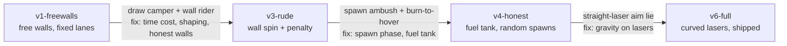

# The reward spec, and how it got gamed

Every number in the duel's reward function is here, but the numbers are the
least interesting part. This environment's reward design was wrong four times
in instructive ways, and each failure is reproducible in this repo: the exact
rules of each era are a named preset, and the champion that exploited each era
ships as a checkpoint. This document leads with the failures because they are
the point.

The whole history in one picture: each arrow is an exploit and the fix that
ended its era.

## The four exploits

### 1. The draw camper

The first PPO runs plateaued at 100% draws: the agent learned that parking
in a quiet orbit and never engaging avoided the death penalty, and the
reward said nothing against it. Those runs predate this repo and their
replay archives were not lifted, so there is no camping footage to load;
the exploit survives in this document and in the rules that ended it. In
today's arena the same broken spec reliably finds the wall variant instead,
and you can watch that one emerge live in
[experiments/02-reward-hacking](../experiments/02-reward-hacking/README.md).

Fix: a small per-second time cost (`time_cost=0.004` per second of match
time, about 0.36 over a full 90 s episode) plus potential-based approach
shaping (`pot_coef=0.5`). The safe kind of hint, in plain words: give the
agent a running meter tied to its distance from the opponent, and pay it
only for *changes* in the meter. A bonus of exactly that shape provably
cannot change what the best strategy is, only how fast the agent finds it.
Written out, that is `gamma * phi(s') - phi(s)` with the meter
`phi = -c * dist / h`.

### 2. The wall rider

The arena walls were free bounces, and the agent noticed before we did. It
learned to carom off the walls like a pinball: 12.2 wall touches per episode,
using rebounds for propulsion and evasion. By the rules we published it was
winning fair and square; specification gaming is exactly this literal.

*Left: a fresh agent after two minutes of training in the free-walls world
(experiment 02, reference platform), its whole life spent on the boundary.
Right: the shipped champion's episodes, flown as orbits. Regenerate with
[`tools/plot_trajectories.py`](../tools/plot_trajectories.py).*

Reproduce it, counters included:

    python agents/duel_eval.py --model agents/models/duel_ppo_v1.json \
        --rules v1-freewalls --level 10

and compare any modern checkpoint in the same free-walls world (it plays
clean anyway; the habit was learned, not necessary). Watch the curated
episodes at `viz/watch.html?dir=replays/v3-wallrider`. Better still, re-run
the discovery live: a fresh agent finds the same exploit from scratch in
about a minute in
[experiments/02-reward-hacking](../experiments/02-reward-hacking/README.md).

Fix, in the order that matters: **physics first, then values.** First the
walls got honest: a scrape now imparts a decaying spin that fights your
steering (`spin_kick`, `SPIN_DAMP`), which alone collapsed a random policy's
wall-pump survival trick from 46% to 5%. Then the reward priced what
remained: `wall_penalty=0.8`, about 0.8 deaths per strike. Result across the
retrained generation: 12.2 touches per episode down to 0.42.

### 3. The spawn ambush and the burn-to-hover

Spawns were at fixed positions, so the agent memorized them and learned a
7-second opening ambush. Worse, thrust was taxed per second on average, so a
long continuous burn to hover in the opponent's spawn lane was merely expensive
rather than impossible. The tax bounded the mean, not the burst.

Fix: again mechanics before reward. Spawn PHASE is now randomized (the whole
start configuration rotates, so there is no lane to camp: `spawn_phase`),
and thrust runs on a hard fuel tank (`FuelTank`: about 1.5 physics seconds
of continuous burn, then thrust is dead until the tank regenerates). The
tank level is observation element 18, so the agent can plan around it. A
burn-to-hover ambush is now impossible, not merely costly. The tank-vs-tax
measurement is
[experiments/04-fuel-economics](../experiments/04-fuel-economics/README.md).

### 4. The straight-laser aim model (a fidelity bug, not a reward bug)

For several eras this simulation flew the agent's own lasers straight while
gravity curved everything else, including the opponent's shots. The learned
aim model was fitted to that lie about its own ballistics, and it collapses
the moment its shots start to curve
([experiment 05](../experiments/05-curved-lasers/README.md) measures the
collapse). The lesson generalizes: constraints and
physics gaps do not just lower a policy's score, they change what it learns.
`gravity_on_lasers=True` (the `v6-full` preset) closed the gap, and reading
the curve became the learned pilot's edge over the scripted ladder's
straight-line lead aim.

## The current reward, in full

Terminal: +1 opponent dies, -1 you die (either cause). Per step, with the
defaults the reference agents train under:

| term | value | why it exists |
|---|---|---|
| hit shaping | +/-0.3 per hit dealt/taken | the duel is scored per hit; score-shaped, not hand-authored strategy |
| potential shaping | `pot_coef=0.5` on distance | safe approach incentive (see camper) |
| time cost | 0.004 per match second | draws are not free |
| wall penalty | 0.8 per own strike | rebound play is not orbit play |
| thrust cost | 0.05 per match second lit | orbit shifts are deliberate, paid acts |

(The code calls match time "wall time", as in wall clock. It has no relation
to the arena walls.)

One provenance note: the shipped v6 champion's own training run priced wall
strikes at 1.5, above the win, per the refinement lesson in
[LEARNING-NOTES.md](LEARNING-NOTES.md) Stage 4; the preset default above is
the era's original price.

Constraints as rules, not rewards: the fuel tank (burst budget), the fire
cone (trigger works only within 15 degrees of the bow, in plausible range,
with a clear line past the hole), spawn-phase randomization, and wall spin.
Each one exists because a reward-only version of it was gamed first.

## Era presets

| preset | walls | fuel | spawn | lasers | era it reproduces |
|---|---|---|---|---|---|
| `v1-freewalls` | free | none | fixed lanes | straight | wall rider, draw camper |
| `v3-rude` | spin + penalty | none | fixed lanes | straight | spawn ambush, burn-to-hover |
| `v4-honest` | spin + penalty | tank | randomized | straight | honest but aim-handicapped |
| `v6-full` | spin + penalty | tank | randomized | curved | the shipped rules |

`OrbitDuelEnv(rules="v1-freewalls")` gives you the broken world back; the
presets live in [`orbitduel/env.py`](../orbitduel/env.py), and explicit
constructor arguments override any preset field. The `info` dict reports
`wall_touches`, `thrust_frames`, `longest_burn_s`, and the round-end cause,
so every exploit above is measurable, not anecdotal.

---

Where next: watch a fresh agent rediscover exploit 2 in
[experiments/02-reward-hacking](../experiments/02-reward-hacking/README.md),
or read how each era's training actually went in
[LEARNING-NOTES.md](LEARNING-NOTES.md).
