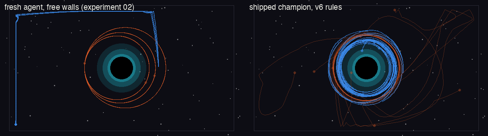
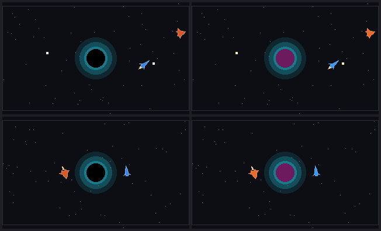
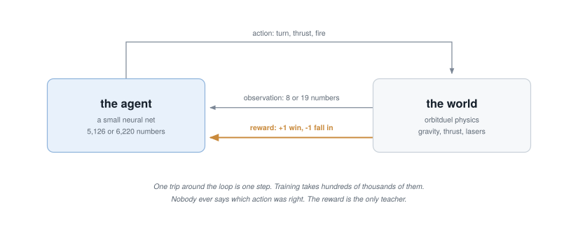

# Start here

This page is for the reader who opened the repo, saw "Double DQN" and "int8
segmentation net", and felt the door start to close. It stays in plain
English: no math, no code, about five minutes. By the end you will know what
this repo is, what happened in it, and where to click next.

Already fluent in RL and CNNs? Skip straight to the
[README quickstarts](../README.md#quickstart-the-pilot), the
[reward spec](REWARD-SPEC.md), or the
[spotter design notes](SPOTTER-DESIGN.md).

## The story so far

It starts with a duel. The arena in this repo is a two-ship dogfight around
a black hole: gravity is strong, fuel is short, and the winning move is
usually a better orbit rather than a better trigger finger. The question
behind everything here: could a small neural network learn to fly that duel,
from nothing, on a laptop? The full write-up is
[Half a worm, flying a spaceship](https://stonej-gh.github.io/research/worm/);
what follows is the arc.

Learning by trial and error needs millions of tries, so the arena is built
for speed: [`orbitduel/`](../orbitduel) simulates the gravity, thrust, and
lasers with no graphics, at roughly 12,000 steps per second on an ordinary
CPU. The first learner got the training-wheels task: spawn on an
orbit that is doomed to spiral into the black hole, and learn to burn your
way out. A network with 5,126 numbers in its head learns that rescue in a few
minutes.

Orbital motion is unintuitive at first, and the arena leans on it hard.
[Think in orbits](https://stonej-gh.github.io/orbits/) covers the parts that
matter here, like why you brake to catch something ahead of you, and why
aiming straight at an opponent misses.

Then came the duels, and the duels came with scandals. The reward said win;
it did not say fly well. One early agent learned that parking in a quiet
orbit far from the fight avoided ever losing. A later one noticed the arena walls were free
bounces and caromed around like a pinball, winning by the letter of rules
nobody meant to write. Each time, the rules got honest and the era got a
name. All of it is preserved: every era is a named rule preset, the era
champions ship as checkpoints you can replay (the wall rider included), and
[REWARD-SPEC.md](REWARD-SPEC.md) narrates all four failures with every
number. The modern champion trained in a league (against every scripted
opponent plus frozen copies of its own past selves) and swept the whole
scripted ladder of its era; the arena's physics and its scripted opponent
have since been rebuilt to match the original game's, and the top rungs are
close matches again.

*The arena, and the two ways to fly it. Left: a wall-hugging cheat, fresh
from a rulebook with a loophole. Right: the champion, whose trail is a ring
around the black hole. Blue is the learner, orange its opponent.*

The other half of the repo watches those same duels through a different kind
of network. The spotter never chooses an action; it looks at rendered frames
and labels every pixel: fighter, interceptor, laser, hole, background. Its
best trick is where the answer key comes from: the renderer that draws its
training frames also draws the labels, so every label is free and exact. Then
it gets small: 28,126 numbers, squeezed down to 8-bit integers with a
measured cost of about one pixel per frame, packaged so the result can be
proven correct on any machine, including hardware that has never heard of
Python.

*What the spotter sees (left) and the answer key it learns from (right):
the renderer that draws the frame also draws the labels, so every label is
free and exact.* That story is
[The net that watches the screen](https://stonej-gh.github.io/research/spotter/),
and the rest of [the lab notebooks](https://stonej-gh.github.io/research/) sit
alongside both.

## What is a neural network

A neural network is a pile of arithmetic with adjustable knobs. Numbers go
in (here: 8 readings about the ship's orbit), get multiplied by stored
weights, summed, bent by a simple rule, and passed to the next layer; at the
end come a few output numbers, one per possible move, and the ship takes the
move with the biggest number. Training means nudging the weights, over and
over, so that outputs leading to good outcomes get bigger. There is no
mystery box in this repo: the pilot's entire decision process is 13 lines of
ordinary Python (`_forward` in
[`orbitduel/netpilot.py`](../orbitduel/netpilot.py)), readable in one sitting.

## What is reinforcement learning

Reinforcement learning is the trial-and-error half of machine learning.
Nobody labels correct answers. The agent acts, the world responds, and a
score called the reward arrives: stay alive, plus one; crash into the black
hole, minus ten. From millions of tries, the learning algorithm works out
which actions tend to lead to reward and shifts the network toward them. The
craft is in designing the world and the reward, and this repo is honest
about that being where all its own failures lived.

The pilot's vocabulary
(DQN, PPO, replay buffers, leagues) is defined one term at a time in the
[glossary's pilot ladder](GLOSSARY.md#the-pilots-ladder-reinforcement-learning).

## And what is a CNN

To a program, an image is a grid of numbers: three per pixel. A
convolutional neural network (CNN) is a network shaped for grids: instead of
looking at the whole image at once, it slides small learned stencils across
it, each stencil lighting up where its pattern appears (an edge, a bright
dot, an orange wedge). Stack those layers and the net goes from spotting
edges to spotting ships. The spotter is a complete, working CNN small enough
to read, and the
[glossary's spotter ladder](GLOSSARY.md#the-spotters-ladder-vision) builds
its vocabulary from "images are numbers" on up.

## One warning about words

The repo has two RL tasks with different sizes of everything. The survive
task feeds its net 8 numbers and offers 6 actions; the duel feeds 19 numbers
and offers 12. Docs use the same words for both: observation (the numbers
the ship sees each step) and action (the move it picks). If
a number seems off by a factor of two, check which task you are reading
about.

## Where to go next

**Just want to watch?** Do the one-time [README setup](../README.md#setup),
then from the repo root run `python -m http.server 8000` and open
`http://localhost:8000/viz/watch.html`. That is the champion against the top
scripted bot, and `?dir=replays/v3-wallrider` in the URL bar swaps in the
pinball cheater. Nothing to install, nothing to train, nothing to break.

**Want the ideas?** Read the [glossary](GLOSSARY.md) ladders in order, then
[LEARNING-NOTES.md](LEARNING-NOTES.md), which retells the project as six
stages of concepts, failures, and do-it-yourself exercises. Every exercise
has a worked answer with a runnable sample solution in
[exercises/](../exercises/README.md), the back of the book.

**Want to run something?** The [README](../README.md) quickstarts train the
survivor and retrain the spotter from scratch. Then try the
[experiments](../experiments/README.md): each is one question with a method
and a measured answer, marked by reading level, and
[02-reward-hacking](../experiments/02-reward-hacking/README.md) is the one to
try first, because watching a fresh agent discover the wall cheat in about a
minute of CPU teaches more about reward design than any definition can.
