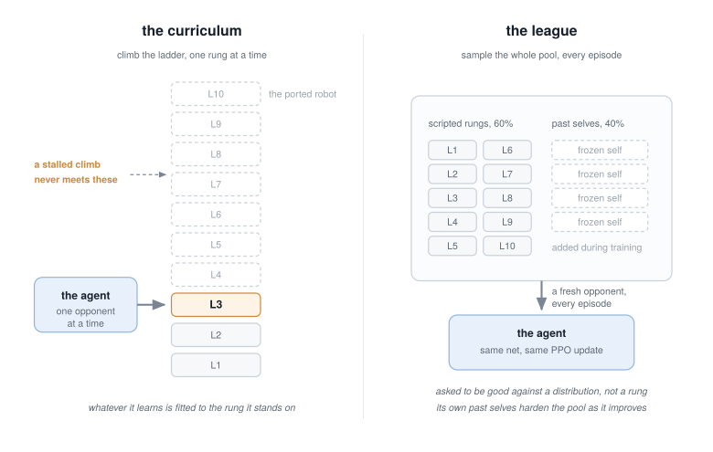

# Experiment 03: curricula climb, leagues generalize

*Level: intermediate. In plain English: an agent that only ever practices
against its current rival ends up good at that rival. An agent that practices
against everyone it has ever met ends up good across the board. This
experiment puts both on one panel under one set of rules and measures how far
each one's skill reaches.*

**Question.** A curriculum trainer walks a ladder of opponents L1 -> L10 and
always practices against the current teacher. A league trainer samples from a
pool holding every scripted level plus frozen snapshots of the agent itself.
Judged on the same four opponents under the same rules, how far does each
one's competence spread?

**Method.** Evaluate shipped checkpoints against the fixed scripted panel
(L1 / L4 / L7 / L10), 48 episodes a cell on fixed seeds. The headline matrix
puts **every checkpoint under one common era**, `v6-full`, so the rules are
held still and the trainer is the thing that varies; a second matrix runs
each checkpoint in the era it trained under, for reference. Inference goes
through the pure-Python reference forward
([orbitduel/netpilot.py](../../orbitduel/netpilot.py)), so every cell is a
deterministic integer: two runs on one machine match byte for byte. A few
knife-edge episodes can flip by a single game across environments
(interpreter and math-library differences), which is why the grader asserts
margins rather than the exact matrix.

Every cell also reports **median wall touches**, because a win rate bought by
riding the walls is [experiment 02](../02-reward-hacking/README.md)'s exploit
in disguise, and a generalization claim resting on it would be worthless.

The checkpoints:

| checkpoint | trainer | trained under | note |
|---|---|---|---|
| [duel_ppo_v1](../../agents/models/duel_ppo_v1.json) | curriculum ladder ([agents/ppo_duel.py](../../agents/ppo_duel.py)) | `v1-freewalls` | cleared all ten rungs in an arena where walls were free |
| [duel_ppo_v2_L3grad](../../agents/models/duel_ppo_v2_L3grad.json) | curriculum ladder | `v3-rude` | the same trainer once walls cost something; its climb stalled, and the name records the last rung it graduated |
| [duel_ppo_v3_league](../../agents/models/duel_ppo_v3_league.json) | league ([agents/league_duel.py](../../agents/league_duel.py)) | `v3-rude` | first league run |
| [duel_ppo_v6_final](../../agents/models/duel_ppo_v6_final.json) | league | `v6-full` | the era champion, trained against the pre-port opponent |
| [duel_ppo_ported_phone](../../agents/models/duel_ppo_ported_phone.json) | league | `v6-full` | trained against the ported ladder; the tablet profile has its own, and `run.py` picks whichever matches `ORBITDUEL_FIELD` |

**Expected result** (measured 2026-07-31, 48 episodes a cell, wins and median
wall touches, every row judged under `v6-full`):

| | L1 | L4 | L7 | L10 |
|---|---|---|---|---|
| v1 curriculum | 7 / 5.0 | 6 / 4.0 | 3 / 5.0 | 6 / 3.0 |
| v2 curriculum | **45** / 0.0 | 22 / 0.0 | **4** / 0.0 | 2 / 0.0 |
| v3 league | 46 / 1.0 | 42 / 1.0 | 36 / 1.5 | 21 / 3.5 |
| v6 league champion | **47** / 0.0 | 43 / 0.0 | **29** / 0.0 | 3 / 0.0 |

**The result is the middle of the panel.** Read the two bold rows. Against
the easiest opponent the ladder-trained checkpoint and the league champion
are the same policy for practical purposes, 45 and 47 wins out of 48. Move
three rungs up and they have come apart: 4 against 29. Both fly with a median
of zero wall touches, so nothing here is the wall exploit. Same rules, same
seeds, same panel, and the only thing that differs is what the agent was
asked to beat during training.

**Why the ladder row falls off.** The v2 climb stalled at L3, so L7 was an
opponent it had never seen. That is the mechanism rather than an unfair
handicap: on a ladder, coverage is contingent on climbing, and a climb that
stalls leaves everything above it unvisited. The pool has no such failure
mode, since every level is in the mix from the first episode. This is the
same argument AlphaStar and OpenAI Five made for leagues, at a scale you can
rerun on a laptop.



**Two rows worth reading sideways.** The v3 league row is the broadest the
repo ships, and it holds L10 at 21 where the champion holds it at 3. It also
carries a wall habit from its permissive training era (median 1.0 to 3.5
touches an episode against the champion's 0.0), so part of that reach is
bought with a behavior the later eras priced out. The v1 row is the same
story with the volume turned up: it is the wall-rider from
[experiment 02](../02-reward-hacking/README.md), and under honest walls it
wins 7 of 48 while still scraping 5 times an episode. An exploit generalizes
about as well as the arena that permits it.

**The limit of the claim is the L10 column.** Every checkpoint in the table
above trained against the scripted opponent as it stood before the 2026-07
fidelity port, and today's L10 flies the ported behaviour. None of them holds
it. So the right reading of that matrix is that a league buys reach across
opponents it was trained among, and it does not buy reach across an opponent
that changed underneath it.

**Which is testable, so it was tested.** `duel_ppo_ported_phone` and
`duel_ppo_ported_tablet` are league champions trained against the ported
ladder, one per field profile, and they are the same trainer and the same
recipe with only the opponent changed. Measured at 200 episodes a level on
seeds nothing was selected on:

| phone profile | L1 | L4 | L7 | L10 | panel |
|---|---|---|---|---|---|
| v6 league champion | 198 | 170 | 118 | **19** | 63.1% |
| ported champion | 199 | 188 | 157 | **104** | 81.0% |

L10 goes from 19 wins in 200 to 104. The opponent was the gap, and the rest of
the recipe did not have to change to close it. On the tablet profile the same
move is smaller and concentrated at the top: panel 63.7% to 70.0%, and L10
from 14.2% to 34.2% measured at 400 episodes, which is a paired result at
chi = 6.28. Below the top rungs the tablet champion and v6 are the same
policy for practical purposes.

**A worked example of not trusting your own table.** The first version of this
page reported that v6 "holds L7 slightly better" on tablet, 140 against 133 out
of 200, and offered it as the honest blemish inside a good result. It was not a
result at all. That gap is 0.75 standard errors, and re-measured at 400
episodes with the two policies paired on identical seeds it reads 66.0% against
65.5%, McNemar chi = 0.08. There is no L7 regression. A number that moves the
wrong way is not automatically a finding, and reporting it as one is the same
error as reporting a lucky win rate, wearing a humbler face.

**The seed spread is the part worth staring at.** Three seeds per profile, and
on phone they landed at 63.1%, 78.3% and 79.6%. The worst of the three is
indistinguishable from v6. Had this been trained once, the story would have
been a coin flip between "the opponent was everything" and "nothing changed",
decided by the seed. The tablet spread looks tighter (65.8%, 68.8%, 69.2%),
and that appearance is a trap, which is the next section.

**Averaging four rungs can hide two different pilots.** The tablet seeds 1 and
2 have panel means 0.4 points apart, well inside noise, so selection picked
between them by coin flip. They are not the same policy. At 400 episodes a
rung, paired on identical seeds:

| tablet | L7 | L10 |
|---|---|---|
| seed 1 | **72.5%** | 16.2% |
| seed 2 | 65.5% | **34.2%** |
| paired McNemar | chi = 2.07 | chi = 5.72 |

Both differences are real and they point in opposite directions, so the
four-rung average cancels them and reports a tie. Seed 2 shipped, which is
the right champion if you care most about the hardest opponent, but nothing
in the selection criterion knew that; it was luck. The phone seeds show no
such split (L7 and L10 differ by 0.16 and 0.52 standard errors). The trainer
has since been changed in response: its confirmation pass now scores the full
ten-rung ladder, and candidates that tie inside noise resolve toward the
better L10, so the next champion is chosen by a criterion that can see this
split. The shipped checkpoints predate that change.

**Read that table again as a statement about the ladder.** Seed 1 experiences
the L7 to L10 step as 56.2 points of extra difficulty. Seed 2 experiences the
same step as 31.2 points. The difference between those two gradients is 5.64
standard errors, so it is not a sampling artifact: **how steep this ladder is
depends on who is climbing it.**

That should be less surprising than it first looks. The rungs are ordered by
the scripted robot's own parameters, and that ordering was checked by watching
scripted pilots meet each other. A learned net is a different kind of strategy
and owes that ordering nothing. It is the same non-transitivity the
[league](../../docs/GLOSSARY.md#league) exists to handle, rock beating scissors
beating paper, showing up inside what looks like a simple difficulty scale.

**What did NOT survive testing, which is the more useful half.** The obvious
next claim is that the ORDER flips too, that some net finds a lower rung
harder than a higher one. A 60-episode sweep of all ten rungs appears to show
exactly that in four places. Every one of them evaporated on re-measurement:
the strongest case, one champion reading L6 harder than L7, reads 75.2% at L6
against 71.5% at L7 at 400 episodes, with the ladder's own order intact. The
gradient varies by policy. Nothing here shows the order does, and the
apparent evidence that it did was noise at small n, found while re-testing a
different claim that had already turned out to be noise at small n.

The lesson is about the yardstick rather than the seeds. A mean over a panel
answers "how good", and it cannot answer "good at what". When two candidates
tie on it, look at the profile before believing they are interchangeable.
Any single-seed claim about a training change in this repo, including the ones
in [docs/LEARNING-NOTES.md](../../docs/LEARNING-NOTES.md), should be read
against all of this.

**Caveats.** One training seed per trainer, and the budgets were never
matched: [docs/LEARNING-NOTES.md](../../docs/LEARNING-NOTES.md) Stage 4
records the curriculum run at 5,000 updates against the league's 20,000. This
matrix compares the artifacts this repo ships, so a matched-budget rerun is
an open DIY rather than a settled control. The n is 48 for a reason: at 12
episodes the v1 row changed direction three times while the opponent was
being ported, which was sampling noise reading as a result.

## Run it

```
python experiments/03-generalization/run.py            # both matrices, all six shipped checkpoints
python experiments/03-generalization/run.py --episodes 12
python experiments/03-generalization/run.py --era v3-rude
python experiments/03-generalization/run.py --model runs/duel/final.json --rules v6-full
```

The default run takes a few minutes; 48 episodes a cell is what these claims
need, and a smaller `--episodes` is for a quick look rather than a number
worth quoting. The last form is the invitation: train your own checkpoint
(any trainer in [agents/](../../agents)), export it, and your row joins both
matrices next to the shipped ones.

## Grade it

```
python -m pytest experiments/03-generalization/grade.py -m grade_cheap -q
```

The grader asserts the L1 wash between the two trainers, the L4 and L7 gaps
that follow it, a median-wall-touch bound on both rows so the gap cannot be
the wall exploit, and the v3 league floor across the whole panel in its own
era.

## Break it

Point `--era` at `v3-rude` and watch the v3 league row climb to 48/47/41/34
while its wall touches stay put. Which part of that is a better policy, and
which part is an easier arena? The wall-touch column is there to help you
answer, and the honest answer needs the [experiment
02](../02-reward-hacking/README.md) counters, not the win column alone.
The back of the book, with the climb decomposed one era flag at a time, is
[exercises/exp03-break](../../exercises/exp03-break/README.md).
